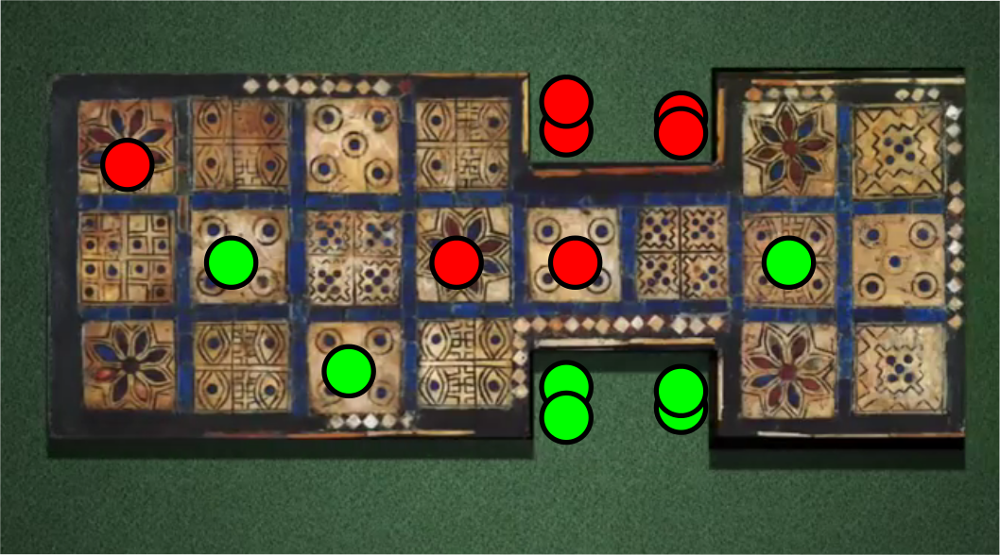

==============================
The (Classic) Royal Game of Ur
==============================
.. image:: Royal-Game-of-Ur.jpg
  :align: center
  :scale: 25 %

The Royal Game of Ur (ROGOUR) is a 5000 year old board game. Watch this
entertaining `video <https://youtu.be/WZskjLq040I>`_ for an excellent
introduction by Irving Finkel. Finkel, a curator in the British museum and a fan
of the game since childhood, deciphered the game rules from a 4000 years old
cuneiform tablet which describes a **modern** versions of the game!

I was immediately captivated, which is hardly surprising. The game has been
capturing the hearts of men, women and children for thousands of years. But it
was not just the cool factor, the unusual dice, and the idea that we can play it exactly
like our great ancestors. I was also drawn by the game's compact form: with only
14 pieces on 20 squares it might be small enough to crack on my own small
laptop!!  Even more, I was intrigued when Finkel claimed with great authority
that the balance of luck and skill in ROGOUR is 50%-50%, while Backgammon is
closer to 40-60. I will return to this question of luck vs. skill later, but for
now let me say I suspect Finkel underestimates how much skill can hide in a simple
looking games like ROGOUR. It is an easy mistake to make; the board is
relatively small and there are only a few moves per position. Yet, looks can be
deceiving. Let me give you a taste. You are red and rolled a 3. Assuming you
either watched the video or read :ref:`rules`, what is your move?

.. 42lOb

Most players would not think once and hit the green piece at 7, possibly with a
superior smirk towards green. After all, that piece is about to enter the home
stretch, and hitting it costs green 11 whole pips! And now **WE** have a piece
only 4 pips away from the finish line. But it turns out this is not the best move:
at this stage of the game controlling the *safe* 4 square is more important than
hitting. Entering another piece gives red 57.18%, while hitting green gives only
54.2%!! An equity loss of 0.06!
   
This repository contains code relating to ROGUR, the fascinating precursor to
backgammon. At the moment you can play with a very primitive `curses
<https://en.wikipedia.org/wiki/Curses_(programming_library)>`__ interface and
analyze your saved games. You can see one analyzed game in the ``games``
directory.

.. toctree::
   rules
   gamesize
   humanst
   solve
   luck

The ROGOUR code
---------------
.. 50% luck 50% skill = 75%-25%, 0.5 equity ?

.. toctree::
   :maxdepth: 5

   scripts
	      
   urlib

   
Indices and tables
------------------

* :ref:`genindex`
* :ref:`modindex`
* :ref:`search`

..  LocalWords:  Finkel rosetta ROGOUR royalur Rulez gamesize humanst

.. Local Variables:
.. eval: (auto-fill-mode 1)
.. fill-column: 80
.. End:
